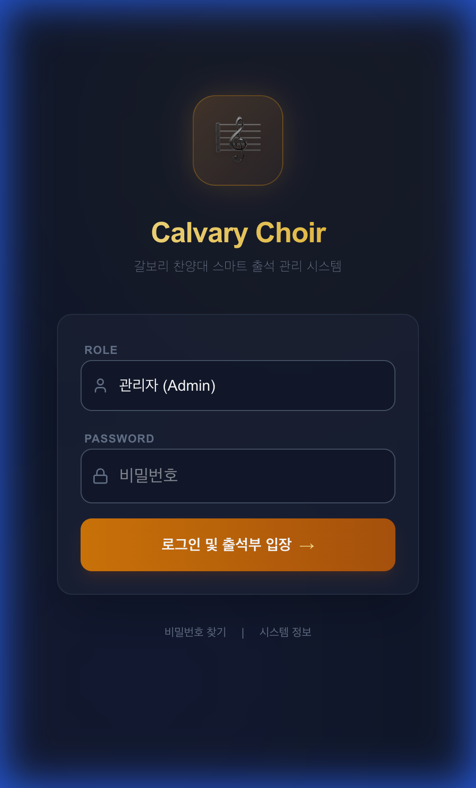
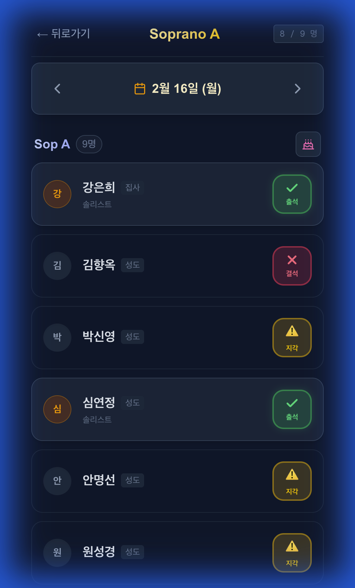
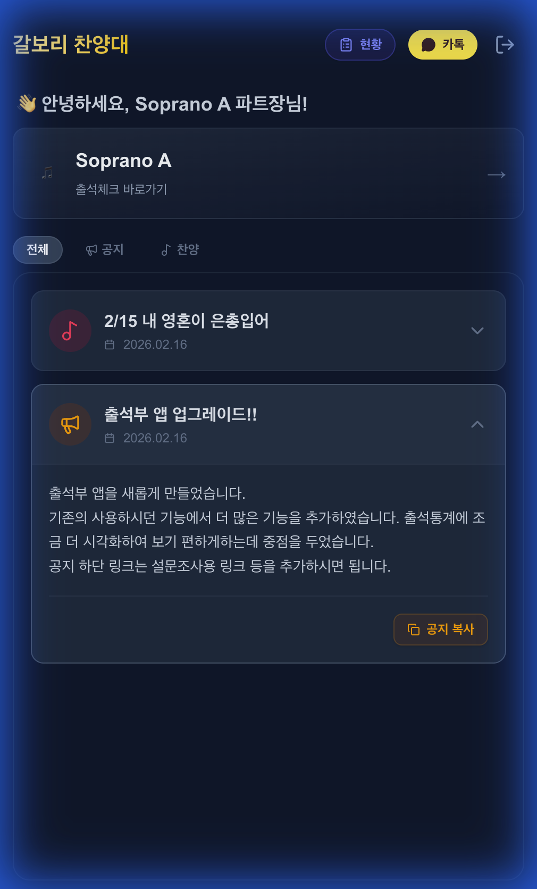

# 🎵 갈보리 찬양대 스마트 출석부 사용 가이드

**버전**: 1.0  
**날짜**: 2026.02.16  
**제작**: Lemon Production

---

## 1. 로그인 (Login)

안전한 시스템 접속을 위해 본인의 **직분(Role)**을 선택하고 비밀번호를 입력해주세요.
관리자 및 각 파트장님은 부여받은 비밀번호로 로그인하실 수 있습니다.

---

## 2. 파트장 대시보드 (Leader Dashboard)

로그인 후 나타나는 메인 화면입니다. 파트장님을 위한 맞춤형 기능을 제공합니다.
화면 상단에는 편리한 바로가기 버튼들이 준비되어 있습니다.

- **[📋 출석현황]**: 우리 파트 대원들의 월간 출석 현황을 한눈에 확인합니다.
- **[💬 단톡방]**: 파트 단톡방으로 바로 이동합니다. (길게 누르면 링크 수정 가능)

---

## 3. 파트 월간 출석 현황 (Part Stats)

상단의 **[📋 출석현황]** 버튼을 누르면 나타나는 화면입니다.
이번 달 우리 파트 대원들의 출석률(%)과 날짜별 출석 여부를 한눈에 파악할 수 있습니다.

- **화살표(◀ ▶)**를 눌러 이전 달, 다음 달의 기록도 조회할 수 있습니다.
- **O**: 출석 / **△**: 지각 / **X**: 결석

---

## 4. 출석 체크 (Attendance Check)

대시보드의 **[출석체크]** 카드를 눌러 이동하는 화면입니다.
오늘 연습/예배에 참석한 대원들을 체크하고 저장합니다.

- **[결석], [지각], [조퇴]** 등 다양한 상태를 기록할 수 있습니다.
- 변경 사항은 실시간으로 안전하게 저장됩니다.

---

## 5. 공지사항 복사 (Notice Copy)

대시보드 하단의 **공지사항(Notice)**을 누르면 상세 내용이 펼쳐집니다.
우측 하단의 **[📋 공지 복사]** 버튼을 눌러보세요.

- 공지 제목, 내용, 링크가 **한 번에 복사**됩니다.
- 복사된 내용을 카카오톡 단톡방에 **붙여넣기**만 하면 공지 전달 끝!

---

**문의사항**: 시스템 관리자 또는 개발팀(Lemon Production)에게 문의해주세요.
